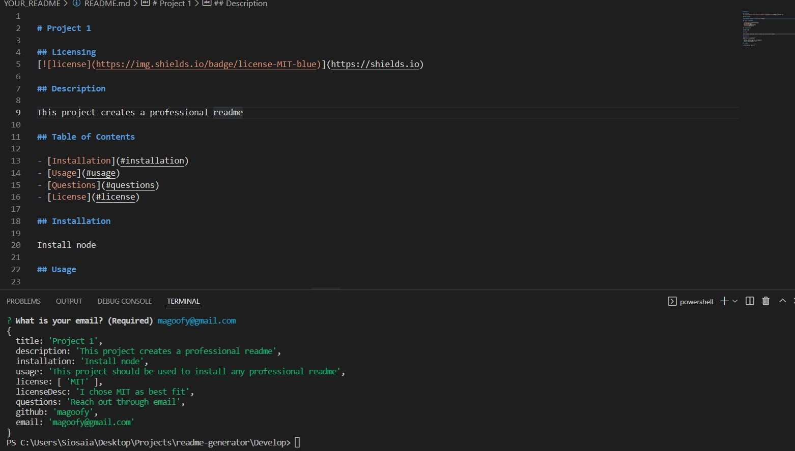

# README Generator

## Description

This project was used as an introduction to Node.js for my Berkeley Coding Bootcamp. I utliized inquirer to prompt the user in the console
for questions, took the user answers, and used fs to write a readme file.

## Usage

You can use this application to generate a professional readme file suitable for your own project.

## Contribution

Afi Akaug

Github: https://github.com/magoofy/

    